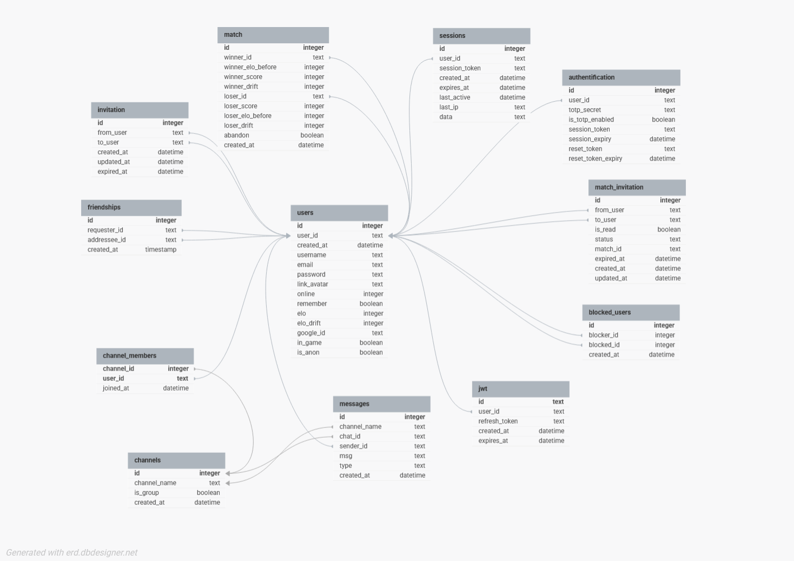

*This project has been created as part of the 42 curriculum by  `ytouihar`, `samraoui`, `abendrih` and `bsuc`*

# FT_TRANSCENDENCE

## Description

**ft_transcendence** is a full-stack web application centered around a **Pong** game.

The goal of the project is to design, develop and deploy a complete web platform combining real-time gameplay, users authentication, social interactions, user account management and production-grade monitoring and logging.

The application allows users to play Pong locally or online, interact with friends, chat in real time, track statistics, and monitor system performance, all within a modern, containerized  architecture.

#### Key features

- Pong game: local game 1v1 or BOT, online game with a remote player and local tournament.
- User management: local authentication (with possibility for two-factor authentication), OAuth with Google, account management.
- Friends and invitations system
- Live chat
- Games statistics
- System monitoring
- Log management

## Instructions

#### Prerequisites

- Docker
- Docker Compose
- Git
- Make (optional)

#### Installation

```bash
git clone <lien du git> ft_transcendence
cd ft_transcendence
```

#### In the directory cloned :

Create a `.env` based on the provided `.env.example` and fill in the required values.

#### Env specifications

<details>
	<summary><b>Google authentication feature</b></summary>
	To enable the <code>OAuth</code> Google authentication you need a Google account and register the project to get <i>CLIENT_ID</i> and <i>CLIENT_SECRET</i> (to fill in the <code>.env</code> file).<br>You can do it at this address : <a href="https://console.developers.google.com"> Google API Console</a>
</details>

<details>
	<summary><b>Forgot password feature</b></summary>
	To enable the <code>reset password</code> feature you need a Google account and create an App Password :
	<ol>
		<li>
			Go to your <a href="https://myaccount.google.com/security">Google Account Security settings</a>
		</li>
		<li>
			Under "Signing in to Google," select App Passwords (you must have 2-Step Verification enabled to see this option)
		</li>
		<li>
			Generate a new App Password for "Mail"
		</li>
		<li>
			Copy the 16-character password and use it in `.env` file in *EMAIL_PASS* and your email address in *EMAIL_USER*
		</li>
	</ol>
</details>

With make:
```bash
make
```

Without make:
```bash
docker compose -f docker-compose.yml build
docker compose -f docker-compose.yml up -d
```

Then access to the main app: [https://localhost:8000]()

Monitoring: [https://localhost:8001]()

Log management: [https://localhost:8002]()

(**Note**:Monitoring and logging services may take up to **5 minutes** to become available after startup.)


## Resources

<details>
	<summary><b>Details</b></summary>
	<ul>
		<li><a href="https://tailwindcss.com/">Tailwindcss</a></li>
		<li><a href="https://vite.dev/">Vite</a></li>
		<li><a href="https://fastify.dev/">Fastify</a></li>
		<li><a href="https://www.rfc-editor.org/rfc/rfc6749">OAuth RFC</a></li>
		<li><a href="https://developers.google.com/identity/protocols/oauth2">OAuth Google</a></li>
		<li><a href="https://grafana.com/docs/">Grafana</a></li>
		<li><a href="https://prometheus.io/docs/introduction/overview/">Prometheus</a></li>
		<li><a href="https://www.elastic.co/docs">Elasticsearch</a></li>
		<li><a href="https://www.elastic.co/docs/reference/elasticsearch/rest-apis">Elasticsearch API</a></li>
		<li><a href="https://www.elastic.co/docs/reference/kibana">Kibana</a></li>
		<li><a href="https://www.elastic.co/docs/api/doc/kibana/">Kibana API</a></li>
		<li><a href="https://www.elastic.co/docs/reference/logstash">Logstash</a></li>
		<li><a href="https://www.elastic.co/docs/reference/beats/filebeat">Filebeat</a></li>
		<li><a href="https://www.typescriptlang.org/tsconfig/">tsconfig</a></li>
		<li><a href="https://nodemailer.com/">nodemailer</a></li>
		<li><a href="https://ipnet.xyz/2025/06/deploying-elk-stack-with-docker-compose-2025-edition/">Deploy ELK</a></li>
		<li><a href="https://github.com/sujeet-agrahari/node-fastify-architecture/tree/main">Fastify Architecture</a></li>
	</ul>
</details>

## Team Information


| Name | Login | Role(s) | Responsibilities |
| :--- | :--- | :--- | :--- |
| **Suc Barbara** | `bsuc` | **Product owner (PO)**, **Project Manager (PM)**, **Developer** | • Global vision of the project<br>• Project design<br>• Schedule weekly sessions<br>• Track progress<br>• Team coordination<br>• DevOps<br>• Frontend|
| **Touihar Yanis** | `ytouihar` | **Technical Lead**, **Developer** | • Technical direction of the team<br>• Design project architecture<br>• Backend<br>• Real-time systems |
| **Amraoui Selim** | `samraoui` | **Developer** | • Game development<br>• AI opponent<br>• Frontend gameplay |
| **Bendrihem Anisse** | `abendrih` | **Developer** | • Game statistics<br>• Live chat<br>• Leaders Dashboard |

## Project Management

#### Work organisation
Feature-based task distribution.<br>
Weekly planning sessions<br>
Daily follow-ups.

#### Tools
Git & Git branching per developer.<br>
Discord for communication and live coding sessions

#### Work mode
On-campus and remote collaboration.<br>
Pair programming when needed.<br>

## Technical Stack

#### Frontend
TypeScript<br>
Tailwindcss<br>
*Vite (for development. Server that instantly reflects changes)*

#### Backend
Fastify<br>
TypeScript<br>
WebSockets<br>
*nodemon (for development. Tool used to automatically restarting the Fastify server when file changes)*

#### Database
SQLite (simple and a light database)

#### Infrastructure & DevOps
Docker & Docker Compose<br>
Nginx<br>
Prometheus/Grafana (monitoring)<br>
ELK Stack (log management)<br>

#### Major technical choices
**Fastify** for high performance and clean architecture.<br>
**WebSockets** for real-time gameplay, chat, and invitations.<br>
**Docker** for reproducible environments and service isolation.


## Database Schema



### Tables

<details>
	<summary><b>users</b></summary>
	<pre>
Table users {
	id INTEGER PRIMARY KEY AUTOINCREMENT,
	user_id TEXT UNIQUE,
	created_at DATETIME DEFAULT CURRENT_TIMESTAMP,
	username TEXT NOT NULL UNIQUE,
	email TEXT NOT NULL UNIQUE,
	password TEXT DEFAULT NULL,
	link_avatar TEXT DEFAULT 'avatar.jpg',
	online INTEGER DEFAULT 0,
	remember BOOLEAN DEFAULT FALSE,
	elo INTEGER DEFAULT 1500,
	elo_drift INTEGER DEFAULT 150,
	google_id TEXT UNIQUE DEFAULT NULL,
	in_game BOOLEAN DEFAULT FALSE,
	is_anon BOOLEAN DEFAULT FALSE
}
	</pre>
</details>

<details>
	<summary><b>authentication</b></summary>
	<pre>
Table authentification {
		id INTEGER PRIMARY KEY AUTOINCREMENT,
		user_id TEXT UNIQUE,
		totp_secret TEXT,
		is_totp_enabled BOOLEAN DEFAULT FALSE,
		session_token TEXT,
		session_expiry DATETIME,
		reset_token TEXT,
		reset_token_expiry DATETIME
	}
	</pre>
</details>

<details>
	<summary><b>sessions</b></summary>
	<pre>
Table sessions {
	id INTEGER PRIMARY KEY AUTOINCREMENT,
	user_id TEXT NOT NULL,
	session_token TEXT NOT NULL UNIQUE,
	created_at DATETIME DEFAULT CURRENT_TIMESTAMP,
	expires_at DATETIME NOT NULL,
	last_active DATETIME DEFAULT CURRENT_TIMESTAMP,
	last_ip TEXT,
	data TEXT DEFAULT '{}'
}
	</pre>
</details>

<details>
	<summary><b>match</b></summary>
	<pre>
Table match {
	id INTEGER PRIMARY KEY AUTOINCREMENT,
	winner_id TEXT NOT NULL,
	winner_elo_before INTEGER DEFAULT 1500,
	winner_score INTEGER DEFAULT 0,
	winner_drift INTEGER DEFAULT 150,
	loser_id TEXT NOT NULL,
	loser_score INTEGER DEFAULT 0,
	loser_elo_before INTEGER DEFAULT 1500,
	loser_drift INTEGER DEFAULT 150,
	abandon BOOLEAN NOT NULL DEFAULT FALSE,
	created_at DATETIME DEFAULT CURRENT_TIMESTAMP
}
	</pre>
</details>

<details>
	<summary><b>channels</b></summary>
	<pre>
Table channels {
	id INTEGER PRIMARY KEY AUTOINCREMENT,
	channel_name TEXT NOT NULL,
	is_group BOOLEAN NOT NULL DEFAULT FALSE,
	created_at DATETIME DEFAULT CURRENT_TIMESTAMP
}
	</pre>
</details>

<details>
	<summary><b>channel_members</b></summary>
	<pre>
Table channel_members {
	channel_id INTEGER NOT NULL,
	user_id TEXT NOT NULL,
	joined_at DATETIME DEFAULT CURRENT_TIMESTAMP,
	PRIMARY KEY (channel_id, user_id)
}
	</pre>
</details>

<details>
	<summary><b>messages</b></summary>
	<pre>
Table messages {
	id INTEGER PRIMARY KEY AUTOINCREMENT,
	channel_name TEXT NOT NULL,
	chat_id TEXT NOT NULL,
	sender_id TEXT NOT NULL,
	msg TEXT NOT NULL,
	type TEXT DEFAULT NULL,
	created_at DATETIME DEFAULT CURRENT_TIMESTAMP
}
	</pre>
</details>

<details>
	<summary><b>jwt</b></summary>
	<pre>
Table jwt {
	id TEXT PRIMARY KEY,
	user_id TEXT NOT NULL UNIQUE,
	refresh_token TEXT NOT NULL,
	created_at DATETIME DEFAULT CURRENT_TIMESTAMP,
	expires_at DATETIME NOT NULL
}
	</pre>
</details>

<details>
	<summary><b>friendships</b></summary>
	<pre>
Table friendships {
	id INTEGER PRIMARY KEY AUTOINCREMENT,
	requester_id TEXT NOT NULL,
	addressee_id TEXT NOT NULL,
	created_at TIMESTAMP DEFAULT CURRENT_TIMESTAMP
}
	</pre>
</details>

<details>
	<summary><b>blocked_users</b></summary>
	<pre>
Table blocked_users {
	id INTEGER PRIMARY KEY AUTOINCREMENT,
	blocker_id INTEGER NOT NULL,
	blocked_id INTEGER NOT NULL,
	created_at DATETIME DEFAULT CURRENT_TIMESTAMP,
	UNIQUE (blocker_id, blocked_id)
}
	</pre>
</details>

<details>
	<summary><b>invitation</b></summary>
	<pre>
Table invitation {
	id INTEGER PRIMARY KEY AUTOINCREMENT,
	from_user TEXT NOT NULL,
	to_user TEXT NOT NULL,
	created_at DATETIME DEFAULT CURRENT_TIMESTAMP,
	updated_at DATETIME DEFAULT CURRENT_TIMESTAMP,
	expired_at DATETIME DEFAULT CURRENT_TIMESTAMP
}
	</pre>
</details>

<details>
	<summary><b>match_invitation</b></summary>
	<pre>
Table match_invitation {
		id INTEGER PRIMARY KEY AUTOINCREMENT,
		from_user TEXT NOT NULL,
		to_user TEXT NOT NULL,
		is_read BOOLEAN DEFAULT FALSE,
		status TEXT NOT NULL CHECK (status IN ('pending', 'accepted', 'declined')), 
		match_id TEXT DEFAULT NULL,
		expired_at DATETIME DEFAULT CURRENT_TIMESTAMP,
		created_at DATETIME DEFAULT CURRENT_TIMESTAMP,
		updated_at DATETIME DEFAULT CURRENT_TIMESTAMP
	}
	</pre>
</details>

### Relations

<details>
	<summary><b>Relations</b></summary>
	<pre>
authentification.user_id > users.user_id
sessions.user_id > users.user_id
match.winner_id > users.user_id
match.loser_id > users.user_id
channel_members.user_id > users.user_id
channel_members.channel_id > channels.id
messages.channel_name > channels.channel_name
messages.chat_id > channels.id
messages.sender_id > users.user_id
jwt.user_id > users.user_id
friendships.requester_id > users.user_id
friendships.addressee_id > users.user_id
blocked_users.blocker_id > users.user_id
blocked_users.blocked_id > users.user_id
invitation.from_user > users.user_id
invitation.to_user > users.user_id
match_invitation.from_user > users.user_id
match_invitation.to_user > users.user_id
	</pre>
</details>


## Feature List

- Gaming: *(`samraoui`)*
  - Local 1v1 Pong
  - Pong vs BOT
  - Local tournament
  - Online Pong *(with `ytouihar`)*

- Authentication: *(`ytouihar`, `bsuc`)*
  - Login/Signup
  - Two factor authentication
  - OAuth
  - Reset password

- Account management:
  - Update user informations (password, username, avatar, email) *(`ytouihar`, `bsuc`)*
  - Link/unlink Google account *(`ytouihar`, `bsuc`)*
  - Enable/Disable two factor authentication *(`ytouihar`, `bsuc`)*
  - Request data *(`samraoui`)*
  - Account deletion *(`samraoui`)*
  - Account anonymization *(`samraoui`)*

- User management: *(`ytouihar`, `bsuc`)*
  - Online status
  - Block/Unblock users
  - Add/Remove friends
  - Sending game/friendship invitation

- Live Chat: *(`abendrih`, `bsuc`)*
  - Game invite in chat
  - Typing indicators
  - Read receipts

- Leaders Dashboard: *(`abendrih`)*
  - Global ranking
  - Friends ranking

- Game statistics: *(`abendrih`)*
  - Match history
  - ELO evolution
  - Some others stats (win rate, best win streak, current win streak...)

- System monitoring *(`bsuc`)*

- Log management *(`bsuc`)*

## Modules

#### Summary
- Major modules: 9 x 2
- Minor modules: 11 x 1

**Total**: 29 points

#### Web
- **Minor**: Use a backend framework = 1pt
  > *A backend framework was required to structure the API, handle routing, validation, and middleware efficiently.*<br>
  >> Fastify was chosen for its performance and modular architecture.<br>
  >>> **`ytouihar`**<br>
- **Major**: Implement real-time features using WebSockets or similar technology. = 2pt
  > *Real-time gameplay and chat require low-latency bidirectional communication between clients and the server.*<br>
  >> Real-time pong with remote players & live chat & invitations (friends/matches) & online status<br>
  >>> **`ytouihar`** **`samraoui`** **`abendrih`** **`bsuc`**
- **Major**: Allow users to interact with other users. = 2pt
  > *User interaction is a core requirement of a multiplayer platform.*<br>
  >> Chat & profile & friends<br>
  >>> **`bsuc`**

- **Minor**: Custom-made design system with reusable components, including a proper color palette, typography, and icons (minimum: 10 reusable components) = 1pt
  > *Logic to have reusable components and harmony throughout the application.*<br>
  > > Some examples : custom-scrollbar, color palette, typography system, renderView, renderSwitchButton, renderButtonEye, renderButtonLogin, renderPong (canvas), tous les game overlay (pause/waiting players/winner) & notifications (invite game, 2fa)<br>
  > **`bsuc`**

- **Minor**: A complete notification system for all creation, update, and deletion actions.
  > *Notifications provide immediate feedback to users after creation, update, or deletion actions, improving usability and clarity.*<br>
  >> Just a little function called to display notifications<br>
  >>> **`samraoui`**

- **Minor**: Implement advanced search functionality with filters, sorting, and pagination.
  > *Advanced search improves usability when handling large user datasets.*<br>
  >> 
  >>> **`abendrih`**


#### Accessibility and Internationalization
- **Minor**: Support for additional browsers. = 1pt
  >> *Works on Firefox, Chrome and Edge without any particular fix*<br>
  >>> **`ytouihar`** **`samraoui`** **`abendrih`** **`bsuc`**


#### User Management
- **Major**: Standard user management and authentication = 2pt
  > *User authentication is required to control access to the platform, manage user sessions, and secure user data.*<br>
  >> Authentication is based on session cookies to check user session. Online status based on a WebSocket to have live update on friends online status. Update user info, upload avatar, friends, page profile<br>
  >>> **`ytouihar`** **`bsuc`**
- **Minor**: Game statistics and match history. = 1pt
  > *Game statistics and match history are required to provide players with feedback on their performance and progression over time.*<br>
  >> Game statistics details win/losses, forfeit, score, date, opponent, level ELO, match history, progression = graph ELO, achievements, dashboard with ranking friends and global.<br>
  >>> **`abendrih`**
- **Minor**: Implement remote authentication with OAuth 2.0 = 1pt
  > *OAuth 2.0 allows users to authenticate using a trusted third-party provider, reducing friction during signup while improving security.*<br>
  >> Google OAuth was integrated + link/unlink Google account from settings.<br>
  >>> **`ytouihar`** (`bsuc`)
- **Minor**: Implement a complete 2FA (Two-Factor Authentication) system for the users. = 1pt
  > *Two-Factor Authentication improves account security by adding an additional verification step during login.*<br>
  >> Enable/disable from settings. A cookie store state of the autentification<br>
  >>> **`ytouihar`** **`bsuc`**

#### Artificial Intelligence
- **Major**: Introduce an AI Opponent for games. = 2pt
  > *An AI opponent allows users to play without requiring another human player, improving accessibility and practice opportunities.*<br>
  >> A client-side bot was implemented to react dynamically to ball position and game state.<br>
  >>> **`samraoui`**


#### Gaming and user experience
- **Major**: Implement a complete web-based game where users can play against each other. = 2pt
  > *A real-time multiplayer game is the core feature of the platform.*<br>
  >> Pong, local : 1v1 or BOT, online remote player, local tournament (between 4 and 8 players). Win/Loss conditions : first to 3 points, 2D<br>
  >>> **`samraoui`**
- **Major**: Remote players — Enable two players on separate computers to play the same game in real-time. = 2pt
  > *Enabling remote players is essential for online multiplayer gameplay.*<br>
  >> WebSockets<br>
  >>> **`samraoui`** **`ytouihar`**
- **Minor**: Advanced chat features
  > *Real-time communication between users is required to support social interactions and multiplayer coordination.*<br>
  >> WebSockets, invite game and notif game in chat, display profile, chat history. Typing indicators and sent/read <br>
  >>> **`abendrih`** **`bsuc`**
- **Minor**: Implement a tournament system. = 1pt
  > *A tournament system allows multiple players to compete in a structured format, increasing engagement beyond single matches.*<br>
  >> Local tournament, registration system and matchmaking system.<br>
  >>> **`samraoui`**

#### Devops
- **Major**: Infrastructure for log management using ELK (Elasticsearch, Logstash, Kibana). = 2pt
  > *Log management is essential for observing system behavior and diagnosing issues in a production-like environment.*<br>
  >> ELK stack were deployed to centralize logs.<br>
  >>> **`bsuc`**
- **Major**: Monitoring system with Prometheus and Grafana. = 2pt
  > *Monitoring is essential for observing system behavior and diagnosing issues in a production-like environment.*<br>
  >> Prometheus and Grafana were deployed to collect metrics.<br>
  >>> **`bsuc`**

#### Data and Analytics
- **Major**: Advanced analytics dashboard with data visualization. = 2pt
  > *Data visualization provides meaningful insights into player performance and ranking evolution.*<br>
  >> ApexCharts package to render graphics with ELO evolution.<br>
  >>> **`abendrih`**

- **Minor**: GDPR compliance features.
  > *GDPR compliance is required to respect user data protection regulations.*<br>
  >> Documentation on GDPR. Request data, anonymize account and delete account. Confirmation for irreversible actions (anonymize/delete)<br>
  >>> **`samraoui`**

**Total points** = 29<br>


## Individual Contributions:

### **`ytouihar`** : (Backend / Real-time)

**Contributions**
- Backend architect with Fastify
- Set up websockets :
  - Pong game (remote players)
  - Live chat
  - Game invitation & friendship invitation
  - Online status
- Management online matches
- API backend
- Authentication (backend)
- OAuth (backend)
- Two-Factor Authentication (backend)

**Modules**

- **Minor**: Use a backend framework
- **Major**: Implement real-time features using WebSockets or similar technology. (*with `samraoui`, `abendrih` & `bsuc`*)
- **Minor**: Support for additional browsers. (*with `samraoui`, `abendrih` & `bsuc`*)
- **Major**: Standard user management and authentication (*with `bsuc`*)
- **Minor**: Implement remote authentication with OAuth 2.0
- **Minor**: Implement a complete 2FA (Two-Factor Authentication) system for the users. (*with `bsuc`*)
- **Major**: Remote players — Enable two players on separate computers to play the same game in real-time. (*with `samraoui`*)

**Challenges & Solutions**

- Challenge: Designing a scalable and maintainable backend architecture while handling both APIs and real-time features.
> Solution: Built a modular Fastify architecture with clear separation of concerns (authentication, game logic, real-time services), ensuring performance and extensibility.

- Challenge: Managing multiple real-time features simultaneously without conflicts or performance issues.
> Solution: Centralized WebSocket handling with event-based routing, allowing different real-time features (game, chat, status, invitations) to coexist cleanly and efficiently.

- Challenge: Keeping remote Pong matches synchronized while preventing desynchronization or cheating.
> Solution: Implemented a server-authoritative model where the backend validates inputs, manages game state, and broadcasts consistent updates to connected clients.

- Challenge: Handling invitation lifecycle (send, accept, decline, timeout) in real time.
> Solution: Implemented event-driven invitation management with backend validation and real-time notifications to users.

- Challenge: Providing a clean and secure API for frontend consumption.
> Solution: Designed structured API endpoints with proper validation, error handling, and consistent response formats.

- Challenge: Securing user authentication while keeping the system flexible.
> Solution: Implemented a robust authentication flow with secure password handling and session management.

- Challenge: Integrating third-party OAuth providers while maintaining a unified user system.
> Solution: Mapped OAuth identities to internal user accounts and handled edge cases such as first-time login and account linking.

- Challenge: Adding an extra security layer without breaking the login flow.
> Solution: Implemented a two-step authentication process with conditional verification, ensuring a smooth and secure user experience.

### **`samraoui`** : (Frontend / Game & UI)

**Contributions**

- Client-side implementation pong game:
  - Canvas 2D
  - Animations, collisions, overlays (pause, victory, waiting)
  - Handled frontend integration of WebSockets for real-time multiplayer pong game.
  - Local pong game
  - BOT for local pong game
  - Pong tournament
  - GDPR features:
    - Request data
    - Anonymize user
    - Delete account

**Modules**

- **Major**: Implement real-time features using WebSockets or similar technology. (*with `ytouihar`, `abendrih` & `bsuc`*)
- **Minor**: Support for additional browsers. (*with `ytouihar`, `abendrih` & `bsuc`*)
- **Major**: Introduce an AI Opponent for games.
- **Major**: Implement a complete web-based game where users can play against each other.
- **Minor**: A complete notification system for all creation, update, and deletion actions.
- **Major**: Remote players — Enable two players on separate computers to play the same game in real-time. (*with `ytouihar`*)
- **Minor**: Implement a tournament system.
- **Minor**: GDPR compliance features.

**Challenges & Solutions**

- Challenge: Rendering a smooth and responsive Pong game entirely on the client side.
> Solution: Used a dedicated render loop to efficiently draw game elements and maintain consistent performance.
- Challenge: Managing animations, collision detection, and multiple UI states without impacting gameplay fluidity.
> Solution: Separated the game loop from UI overlays, allowing collisions, animations, and visual states (pause, victory, waiting) to be handled independently.
- Challenge: Ensuring real-time synchronization and smooth rendering for remote multiplayer matches.
> Solution: Integrated WebSocket event listeners on the frontend to receive game state updates and render them in real time with visual smoothing.
- Challenge: Implementing a complete Pong experience without relying on backend logic.
> Solution: Developed a fully client-side version handling game logic, collisions, scoring, and rendering.
- Challenge: Creating an AI opponent that feels responsive and balanced.
> Solution: Implemented a client-side bot with adaptive paddle movement based on ball position and game state.
- Challenge: Managing multiple matches and transitions within a tournament flow on the frontend.
> Solution: Built a client-side tournament system handling match progression and UI updates.
- Challenge: Providing GDPR-compliant user controls while keeping the UX simple and clear.
> Solution: Implemented frontend interfaces for data requests, account anonymization, and deletion, with clear user confirmation flows and backend integration.

### **`abendrih`** : (User Data / Live chat)

**Contributions**

- Statistics management and matches history:
  - Matches history
  - ELO graph
  - Achievements
  - Matches data
- Users lists filters
- Live chat:
  - Invite game in chat
  - Display user profile
  - Typing indicators
  - Sent/read indicators

**Modules**

- **Major**: Implement real-time features using WebSockets or similar technology. (*with `samraoui`, `ytouihar` & `bsuc`*)
- **Minor**: Implement advanced search functionality with filters, sorting, and pagination.
- **Minor**: Support for additional browsers. (*with `samraoui`, `ytouihar` & `bsuc`*)
- **Minor**: Game statistics and match history.
- **Minor**: Advanced chat features. (*with `bsuc`*)
- **Major**: Advanced analytics dashboard with data visualization.

**Challenges & Solutions**

- Challenge: Visualizing player ELO progression over time in a meaningful way.
> Solution: Implemented interactive charts with client-side data processing and dynamic rendering using a lightweight visualization library.
- Challenge: Displaying earned achievements with proper UX and interactivity.
> Solution: Developed a dynamic achievements panel that updates in real time and highlights unlocked achievements.
- Challenge: Presenting detailed statistics per match while keeping the interface responsive.
> Solution: Created modular UI components to render detailed match metrics and ensure smooth updates.
- Challenge: Allowing users to search and filter large lists efficiently.
> Solution: Implemented client-side filtering with instant feedback.
- Challenge: Integrating real-time game invitations within the chat interface.
> Solution: Added interactive buttons in chat messages that trigger backend invitations and update dynamically on both sender and receiver sides.
- Challenge: Showing when a user is typing in real time without overloading the interface.
> Solution: Used WebSocket events to display typing indicators.
- Challenge: Providing accurate message status feedback in real time.
> Solution: Tracked message delivery and read status via WebSocket events and database storage, updated message UI dynamically.

### **`bsuc`** : (Frontend / DevOps)

**Contributions**

- Development SPA frontend in TypeScript.
- Invite management (game/friendships)
- Reusable design system:
  - Buttons, overlays, notifications
  - Typography and color palette
- Authentication (frontend)
- OAuth (frontend)
- Two-Factor Authentication (frontend)
- Live chat:
  - Chat history
- DevOps implementation:
  - Docker & Docker Compose
  - ELK stack (log management)
  - Prometheus/Grafana (monitoring)


**Modules**

- **Major**: Implement real-time features using WebSockets or similar technology. (*with `samraoui`, `ytouihar` & `abendrih`*)
- **Major**: Allow users to interact with other users.
- **Minor**: Custom-made design system with reusable components, including a proper color palette, typography, and icons.
- **Minor**: Support for additional browsers. (*with `samraoui`, `ytouihar` & `abendrih`*)
- **Major**: Standard user management and authentication. (*with `ytouihar`*)
- **Minor**: Implement a complete 2FA (Two-Factor Authentication) system for the users. (*with `ytouihar`*)
- **Minor**: Advanced chat features. (*with `abendrih`*)
- **Major**: Infrastructure for log management using ELK (Elasticsearch, Logstash, Kibana).
- **Major**: Monitoring system with Prometheus and Grafana.

**Challenges & Solutions**

- Challenge: Building a scalable and maintainable single-page application from scratch.
> Solution: Developed a modular SPA using TypeScript with a clear separation of concerns between components, state management, and services.
- Challenge: Handling real-time invitations and state updates efficiently in the frontend.
> Solution: Implemented an event-driven system with WebSocket integration for game and friendship invitations, providing instant UI feedback.
- Challenge: Maintaining a consistent look and feel across the application.
> Solution: Defined a global design system with standardized fonts, colors, and spacing, applied throughout the SPA.
- Challenge: Securely handling login flows and user sessions in the client.
> Solution: Implemented a frontend authentication module with form validation, session handling, and error feedback.
- Challenge: Integrating third-party authentication while maintaining seamless UX.
> Solution: Handled OAuth flows in the frontend, including redirects, token handling, and mapping to internal user accounts.
- Challenge: Implementing a smooth 2FA flow without disrupting login or registration UX.
> Solution: Developed a frontend flow for TOTP verification, including error handling, retry, and UX feedback.
- Challenge: Displaying chat history efficiently while supporting real-time updates.
> Solution: Implemented dynamic chat rendering for history and live WebSocket updates for new messages.
- Challenge: Containerizing multiple services with proper networking and environment configuration.
> Solution: Built Dockerfiles for frontend and backend and configured a Docker Compose set up for easy local deployment.
- Challenge: Set up ELK
> Solution: Documentation, Stack Overflow and suffering.
- Challenge: Monitoring multiple services in real time with meaningful metrics.
> Solution: Exposed metrics endpoints in containers, configured Prometheus scraping, and created Grafana dashboards for visual monitoring.
